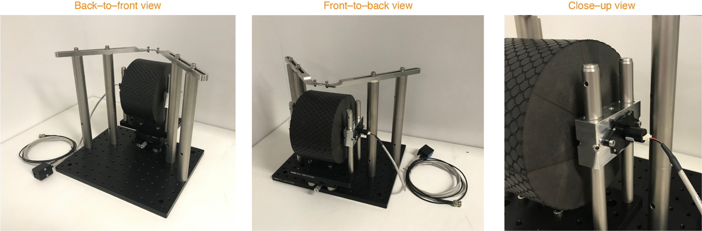

# Flexible treadmill system for measuring locomotion in head-fixed mice

This repository contains: 

1) blueprints for the manufactoring of custom components for the treadmill system
2) example treadmill activity data files
3) code for converting the raw magnetic encoder-derived voltage signal into velocity and for extracting various quantitative measures from this signal.

Custom components 
--------
This folder contains blueprints for the manufactoring of the following components:

<ul>
<li> Foam roll
<li> Ball-bearing blocks
<li> Headplate-fixation arms
<li> Headplate
<li> Rotary encoder interface box  
</ul>

Example treadmill data
--------
This folder contains raw .ABF data files recorded with Axon Clampex software during habituation sessions.

Analysis code
--------
This folder contains code for analysis of the treadmill-derived data. The code is written in MATLAB and organized into a master script (“TreadmillMaster.m”) which calls three main functions: “getABFfiles.m”, “getLocVel.m”, and “getLocVelQuant.m”. The final part of the master script generates figures and saves a file containing the computed locomotion metrics and quantifications.

Contact
--------
For further information and requests for resources, contact Rune Nguyen Rasmussen, PhD (rune.nguyen.rasmussen@sund.ku.dk).
